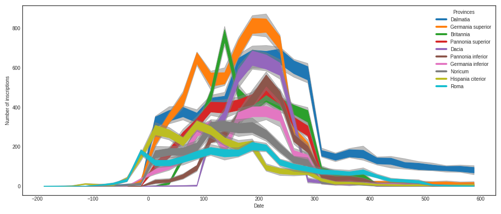

# Inscriptions as data: digital epigraphy in macro-historical perspective 




## Authors
* Petra Hermankova [](https://orcid.org/0000-0002-6349-0540), Social Dynamics in the Ancient Mediterranean project, Aarhus University, petra.hermankova@cas.au.dk
* Vojtech Kase [](http://orcid.org/0000-0002-6601-1605), Social Dynamics in the Ancient Mediterranean project, Aarhus University
* Adela Sobotkova [](https://orcid.org/0000-0002-4541-3963), Social Dynamics in the Ancient Mediterranean project, Aarhus University

## Abstract
As short texts written on a durable medium, inscriptions represent invaluable insight into past societies, their organization, cultural norms and practices. Several hundred thousand inscriptions in Greek and Latin language survived until today, providing us with a line of evidence concerning populations of large cities and rural communities of the entire Mediterranean Basin in the period between the eighth century BC and eighth century AD. Although published inscriptions have been near-completely digitized and exist in online databases, and open computational tools exist to handle large datasets, large-scale and comparative studies of inscriptions are still rare. Numerous technical and conceptual issues, such as the inconsistent resolution of spatial and temporal attributes or the incompatibility of data structures between datasets, hinder the aggregation and analysis of thousands of inscriptions. The incomplete, uncertain and complex nature of inscriptions as a historical source required us to develop a series of custom open-source tools and reproducible pipelines, enabling a macro-scale overview of epigraphic production in time and space. To illustrate the potential of quantitative studies in epigraphy, we harvest and render comparable two well-established, yet very distinct, digital collections for Latin epigraphy: *Epigraphic Database Heidelberg (EDH)*, containing over 81,000 records and *Epigraphische Datenbank Clauss-Slaby (EDCS)* with over 500,000 records. Placing the datasets side-by-side, we contrast past interpretations of epigraphic habit based on limited samples with trends derived from all available data and discuss their strengths and shortcomings of each respective dataset. We assert that research communities stand to gain from extending digital infrastructures to reduce barriers to access with packages of open and reusable research tools. 

## Keywords
digital epigraphy; quantitative research; FAIR science; reproducibility; digital history; Latin inscriptions; epigraphic production

## License
CC-BY-SA 4.0, see attached [License.md](https://github.com/sdam-au/digital_epigraphy/blob/master/LICENSE.md)

## How to cite this resource (DOI, etc.)
TBA

---

# Data
1. [Epigraphic Database Heidelberg (EDH)](https://edh-www.adw.uni-heidelberg.de/home) dataset is accessed and transformed by the series of Python and R scripts in [EDH ETL repository](https://github.com/sdam-au/EDH_ETL) and in [EDH exploration repository](https://github.com/sdam-au/EDH_exploration), created by SDAM Project. The latest version of the dataset (as JSON file) can be accessed via Sciencedata.dk or at this link: [EDH_public folder](https://sciencedata.dk/shared/b6b6afdb969d378b70929e86e58ad975)
- Alternatively, the data is available via https://doi.org/10.5281/zenodo.4888168
- Result of ETL process JSON file: `EDH_text_cleaned_2021-01-21.json` 
- [EDH dataset metadata](https://github.com/sdam-au/EDH_ETL/blob/master/EDH_dataset_metadata_SDAM.csv) with descriptions for all attributes.

2. [Epigraphic Database Clauss-Slaby (EDCS)](http://www.manfredclauss.de/) dataset is accessed and transformed by the series of Python and R scripts in [EDCS ETL repository](https://github.com/sdam-au/EDCS_ETL), created by SDAM project. The latest version of the dataset (as JSON file) can be accessed via Sciencedata.dk or at this link: [EDCS_public folder](https://sciencedata.dk/shared/1f5f56d09903fe259c0906add8b3a55e). 
- Alternatively, the data is available via https://doi.org/10.5281/zenodo.4888817
- Result of ETL process JSON file: `EDCS_text_cleaned_2021-03-01.json` 
- [EDCS dataset metadata](https://github.com/sdam-au/EDCS_ETL/blob/master/EDCS_dataset_metadata_SDAM.csv) with descriptions for all attributes.

## Data Access

**Access with R (using custom `sdam` package)**

```r
resp = request("EDH_text_cleaned_2021-01-21.json", path="/sharingin/648597@au.dk/SDAM_root/SDAM_data/EDH/public", method="GET")
```

**Access with Python (using custom [SDDK package](https://pypi.org/project/sddk/))**

```python
!pip install sddk
import sddk
auth = sddk.configure("SDAM_root", "648597@au.dk") # where "648597@au.dk is owner of the shared folder
EDH_utf8 = sddk.read_file("public/b6b6afdb969d378b70929e86e58ad975/EDH_text_cleaned_2021-01-21.json", "df", auth)
```


